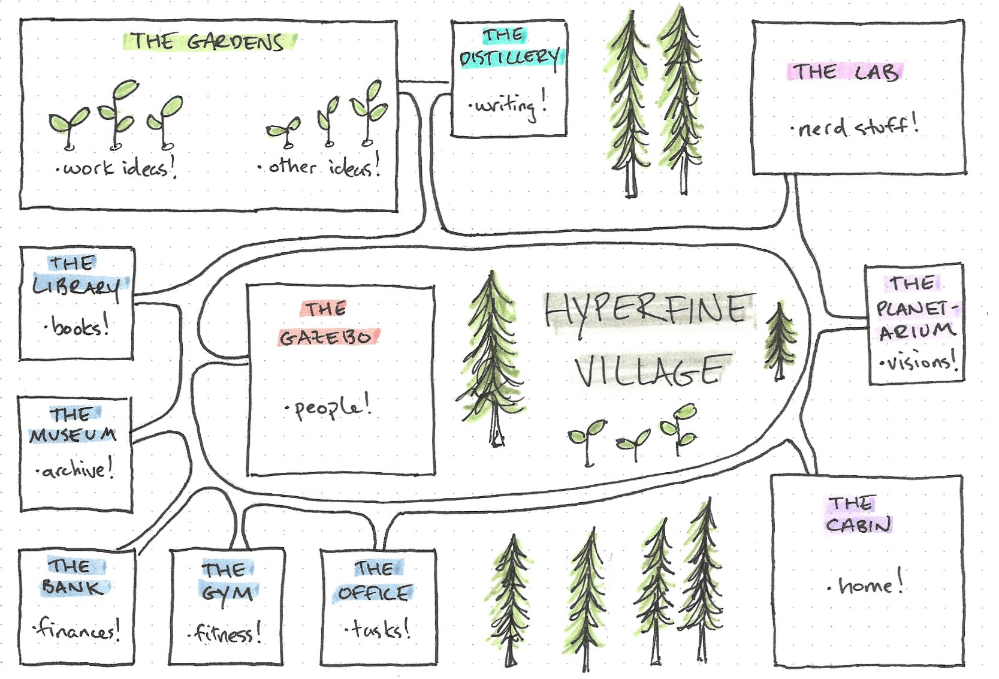
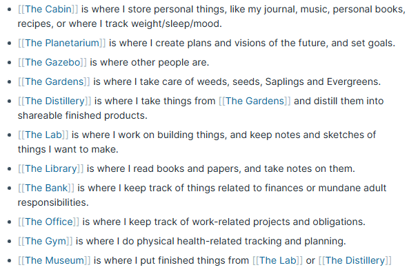
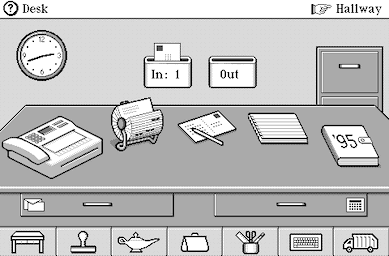

Also spatial computing, peripheral vision
* [Life as a studio | linus.coffee](https://linus.coffee/note/studio/)
* [An Infinite Room for Thought](https://jessmart.in/articles/infinite-room/)
* [Andy Matuschak \(@andy_matuschak\) on X](https://x.com/andy_matuschak/status/1202663202997170176)
* Lisa Hardy's Hyperfine Village
  * [Hyperfine Village Map](https://roamresearch.com/#/app/hyperfinelabs/page/TYt89wtA7)
  * 
  * 
* General Magic’s Magic Cap
  * 

## See also
- [[Digital Object Permanence]]
